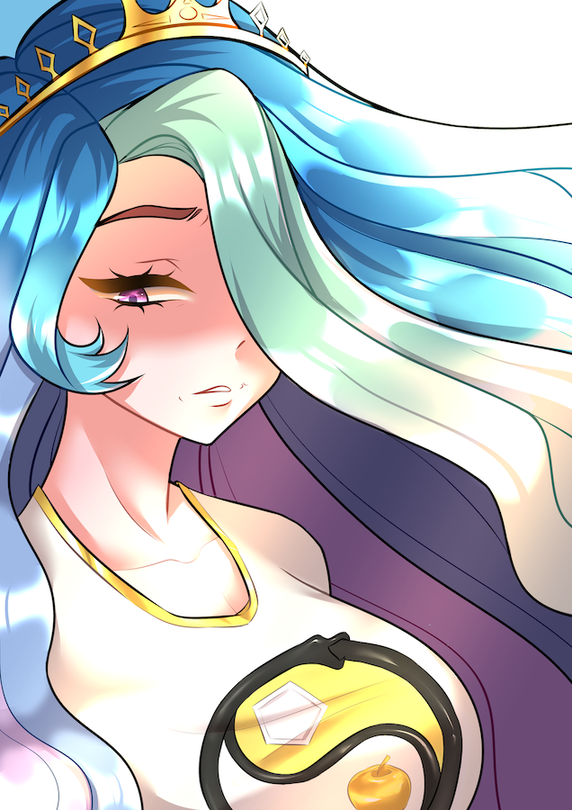

#+TITLE: Солнечная Империя
#+OPTIONS: broken-links:mark

# #+ATTR_HTML: :style float:right;margin:0 5px 5px 0; max-height:300px;
# 

# #+HTML:   

# Письмена и лор Солнечной Принцессы.

#+begin_export html

<figure>
 
</figure>
Письмена и лор <a href="/" class="u-url u-uid">Солнечной Принцессы</a>
Солнечная Принцесса.
  <ul style="list-style-type:circle;">
  <li><a href="/feed_ru.rss">RSS</a></li>
   <li>
     <a href="mailto:TheSunWorshipper@proton.me" id="email" class="u-email">TheSunWorshipper@proton.me</a></li>
   <li>
   <a href="https://www.tumblr.com/tsolarprincess" rel="me"  class="u-url">Tumblr</a></li>
   <li>
   <a href="https://thesolarprincess.substack.com/" rel="me" class="u-url">Substack</a></li>
   <li>
   <a href="https://bsky.app/profile/thesolarprincess.org" rel="me atproto" class="u-url">Bluesky</a></li>
   <li><a href="https://t.me/solarbroadcast" rel="me" class="u-url">Telegram</a></li>
   <li>
   <a href="https://mastodon.social/@thesolarprincess" rel="me" class="u-url">Mastodon</a></li>
   <li><a href="/social.org">Org-social</a></li>
  </ul>

#+end_export

#+name: get-link
#+begin_src emacs-lisp :exports none :var f="" :var path="blog/ru/"
      (with-temp-buffer
        (insert-file-contents (concat path f ".org"))
        (org-mode)
        (let ((title (cadr (assoc "TITLE" (org-collect-keywords '("TITLE"))))))
          (concat
           "☀️ [[file:" path f ".org]"
           "[" title "]]"))
        )
#+end_src

#+MACRO: post #+CALL: get-link(f="$1") :results raw
# #+MACRO: fiction #+CALL: get-link(f="$1", path="fiction/") :results raw

#+BEGIN_SRC emacs-lisp :results output :exports none
(dolist (f (directory-files "blog/ru/" nil "\.org"))
  (princ (format "{{{post(%s)}}}\n" (file-name-sans-extension f))))
#+END_SRC

#+HTML: 

Моя самая признанная работа – [[file:blog/ru/shiftingmound.org][Вид с Зыбкой Гряды]] – личная история травмы, множественных личностей и диссоциации. Она помогла многим людям, и если вы прочитаете только что-то одно со всего сайта, пусть будет это.

Все посты далее.

* -----
:PROPERTIES:
:HTML_CONTAINER_CLASS: twocol
:HTML_HEADLINE_CLASS: hidden
:END:

** Детский лагерь „Шепчущий Камень“

{{{post(identitydisorders)}}}
{{{post(identitydisorders2)}}}
{{{post(pain)}}}
{{{post(antinatalism)}}}
{{{post(appealtonature)}}}
{{{post(foeaddiction)}}}
{{{post(happymary)}}}
{{{post(hell)}}}
{{{post(illuminati)}}}
{{{post(momentofhappiness)}}}
@@html:<a href="blog/ru/shiftingmound.html">☀️ Вид с Зыбкой Гряды</a>@@

** Наша жизнь – игра

{{{post(annoyingrpg)}}}
{{{post(disconarrative)}}}
{{{post(undertaledialogue)}}}
{{{post(gamewalk)}}}
{{{post(gamificationbad)}}}
{{{post(hungrygale)}}}
{{{post(plantsvszombies)}}}
{{{post(skyrimbad)}}}
{{{post(speedruns)}}}
{{{post(tastinggraphics)}}}
{{{post(terraformingmars)}}}

* -----
:PROPERTIES:
:HTML_HEADLINE_CLASS: hidden
:END:
-----

* -----
:PROPERTIES:
:HTML_CONTAINER_CLASS: twocol
:HTML_HEADLINE_CLASS: hidden
:END:

** ¡Viva la revolución!

{{{post(socialism)}}}
{{{post(coercion)}}}
{{{post(pleasanttruth)}}}
{{{post(healthcaremarket)}}}
{{{post(substackbad)}}}
{{{post(whatwoman)}}}

** Все, кроме меня, неправы

{{{post(badwords)}}}
{{{post(causation)}}}
{{{post(doomsday)}}}
{{{post(vitamind)}}}
{{{post(wirehead)}}}
{{{post(likepolitics)}}}

* -----
:PROPERTIES:
:HTML_HEADLINE_CLASS: hidden
:END:
-----

* -----
:PROPERTIES:
:HTML_CONTAINER_CLASS: twocol
:HTML_HEADLINE_CLASS: hidden
:END:

** Эзотерики Эриды

{{{post(copinhead)}}}
{{{post(highenergyphilosophy)}}}
{{{post(highenergylogic)}}}
{{{post(toolvslaw)}}}
{{{post(psychometaphysics)}}}
{{{post(fatima)}}}

** Матемагика

{{{post(cryptoriddle)}}}
{{{post(dilemmadilemma)}}}
{{{post(factsandlogic)}}}
{{{post(naivebayes)}}}
{{{post(paradox)}}}
{{{post(politicstopology)}}}

* -----
:PROPERTIES:
:HTML_HEADLINE_CLASS: hidden
:END:
-----

* -----
:PROPERTIES:
:HTML_CONTAINER_CLASS: twocol
:HTML_HEADLINE_CLASS: hidden
:END:

** Будуар

{{{post(gayidentity)}}}
{{{post(platonicwoman)}}}
{{{post(straightpeopledonotexist)}}}
{{{post(transcyberpunk)}}}

** Медиа-аналитическая некромантия

{{{post(hazbinbad)}}}
{{{post(ostap)}}}
{{{post(papersplease)}}}
{{{post(recognize)}}}
{{{post(tadc)}}}

* -----
:PROPERTIES:
:HTML_HEADLINE_CLASS: hidden
:END:
-----

* -----
:PROPERTIES:
:HTML_CONTAINER_CLASS: twocol
:HTML_HEADLINE_CLASS: hidden
:END:

** Рассказы

{{{post(godoftails)}}}
{{{post(purelyhypothetically)}}}
{{{post(cultureshock)}}}
